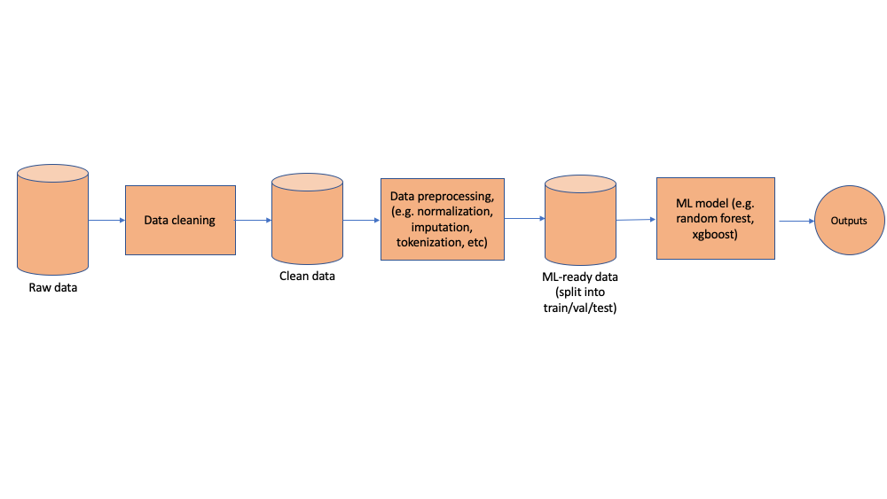

# **A practical guide to data science projects**

Peter Baudains 

[CDRC](https://cdrc.ac.uk) Research Data Scientist

e: p.baudains@leeds.ac.uk

 https://github.com/peterbaudains

---
## Contents

1. Introduction 
2. Reproducibility: Data, Code, and Environments
3. (Handling threats to) Openness: Data Security and DOIs 
4. Delivering impact: Developing and publishing data products
5. [CDRC Data Store](https://data.cdrc.ac.uk) 
6. [CDRC Apps](https://apps.cdrc.ac.uk)

---
## 1. Introduction

Publicly-funded data science research should be...

1. Reproducible
2. Open
3. Impactful

---
### 1.1 Reproducible
Anyone with access to your data and code (which should be as many people as possible) should be able to generate the same conclusions as you did. This strengthens confidence in your findings and is an essential part of the scientific process.

---
### 1.2 Open/Transparent
The legal and ethical requirements for data security notwithstanding, every effort should be made to ensure openness and transparency in how a particular result or finding has been produced. 

Two challenges to openness are in ensuring any data security requirements and in protecting your work and ideas from theft.

---
### 1.3 Impactful
The tagline to the Data Science Development Programme is:

*"Data Science for Public Good"*

Data Science is increasingly used to provide insights and make decisions in different domains. Every project on this year's programme has the ability have a meaningful impact. 

It's well worth identifying the kinds of impact that might be made early on in the project.

---

### 1.4 Goal of the session

The goal of this session is to introduce some surrounding tools and technology that will be helpful in your projects for achieving these three goals. It's also to get you thinking about **how** you tackle your projects from a practical perspective.

The majority of the examples in this session are based from my experience using Python, however, I think most of the content is transferable to any language. 

Even if some of this might sound familiar to you, there will hopefully still be some useful nuggets to take away.

---

### 1.5 A note on CLIs (Command Line Interfaces)

Some of the code snippets used in this presentation are intended to be run on a command line interface to the machine you are using (e.g. cmd in Windows, Terminal on Linux/Mac). 

Being comfortable using some command line tools is a handy skill to have. There's plenty of free online resources available for learning the basics:

1. https://ubuntu.com/tutorials/command-line-for-beginners
2. https://www.freecodecamp.org/news/command-line-for-beginners/
3. [Windows Command Line Tutorials by TheNewBoston](https://www.youtube.com/playlist?list=PL6gx4Cwl9DGDV6SnbINlVUd0o2xT4JbMu)


---


## 2. Reproducibility: Data, Code and Environments

 I'll start with an example...

```
jupyter lab
```

<!--- This example will demonstrate some common pitfalls in doing data science, hitting on some of the issues that may arise from the below sections--->

---

### Q. How to approach this with reproducibility in mind?
1. Separate data from code
2. Separate raw data from processed data
3. Retain all code for converting raw data to processed data
4. Build and think in terms of pipelines
5. Modularise and test your code
6. Version control your code
7. Version control your data
8. Have a Research Data Management Plan
8. Document your code dependencies
9. Use tools for replicating research environments

---

### 2.1 Separate data from code

Set up two directories within your working environment: 

```
~/Data/
~/Code/
```
Then, within your code, create a variable to point to your data directory:

```python
import pandas as pd

data_directory = '~/Data/'

df = pd.read_csv(data_directory + 'data_file.csv')
```

---

### 2.2 Separate raw data from processed data (1)

Actually, it would be better to have something like: 
```
~/Data/Raw/
~/Data/Processed/
```
Where the raw data directory contains your raw data at the start of the project and is only ever read from in your code.

The processed directory is where data can be written. This might contain final datasets for publication. It might also contain intermediate results so that you don't need to re-run the pipeline each time. 

---

### 2.2 Separate raw data from processed data (2)

If you're using a database management system or other type of data storage then this pattern should be replicated. For example if using a SQL database: 

```sql
CREATE TABLE rawData (...)
CREATE TABLE derivedDataSet1 (...)
```
Then only run ```SELECT``` queries on ```rawData``` leaving data updates and data transformations for processed data tables.

---

### 2.3 Retain ALL code for converting raw to processed data

Remember that reproducibility means that if we start from the raw data using your code, it is possible to follow it step-by-step and end up with your results. You can only do this if you retain every piece of code used to generate a dataset in your Processed data file.

---

### 2.4 Build and think in terms of pipelines

Your project code can usually be thought in terms of a pipeline or set of pipelines that take in some raw data and generate some processed data. 


---

### 2.5 Modularise and test your code

Thinking of your project in terms of pipelines can help identify how to _modularise_ your code. 

Make use of functions/package capability in your code and try to design your code so that each component does a single thing. 

Each module can then be tested independently, making debugging easier and minimising the risk of error propagation.

--- 

### 2.6 Version control your code (1)

[Git](https://git-scm.com/) is the most widely used version control system. It can be used on its own without a connection to the internet for monitoring and tracking changes to code. A version control system should always be used to keep a record of changes and to allow the return to a previous version. 

```git 
git init 
git add .
git commit -m "Really helpful commit message here"
```

```git
git status
git log
```

---

### 2.6 Version control your code (2)

[GitHub](https://github.com) is a hosting service for your code. It syncs seamlessly with Git and acts as a remote backup for your code. Repositories on GitHub can be made private or public. 

A public GitHub repository is a great option for making your research openly available.

A handy guide for using Git (and GitHub as a remote server) is here: https://rogerdudler.github.io/git-guide/

---

### 2.7 Version control your data

Some projects will start with initial invariant datasets and proceed in a data pipeline until some results are generated. In these cases, if a permanent link to a dataset in a data repository can be made and the code is publicly available, then the results can be reproduced. 

Other projects will have datasets that change over time. 

Git can be used to version control small datasets, but isn't really designed for large files.

In many cases, reproducibility can be accomplished by having a research data management plan.

---

### 2.8 Research data management plans

A research data management plan details each stage of the research data lifecycle, including data collection, storage and analysis, documentation and metadata, and long-term preservation of the data for reproducibility. 

It should also identify the roles and responsibilities for those involved in the research. 

This may involve identifying individuals who may need to provide support for research environments. 

---

### 2.9 Document your code dependencies (1)

When you install a software package using a package installer/manager such as pip, conda or R/RStudio, it installs a version of the package and a version of each of that package's dependencies.

If we're aiming for reproducibility, we need to document which versions of which packages have been used to generate a particular result. If we always use the latest version of the code, then the functionality may change, which could alter the result.

---

### 2.9 Document your code dependencies (2)

Package managers typically have capability to generate a list of dependencies within any existing environment e.g.:

```conda
conda list -n environment_name
```

will list all dependencies and versions of those dependencies. This can be used to automatically create the same environment (i.e. with the same versions of packages) which were used to generate your results. 


---

### 2.10 Tools for replicating research environments

[Conda](https://docs.conda.io/projects/conda/en/latest/user-guide/getting-started.html) is a tool for (re-)creating Python environments on your system using the same packages used to run your code.

[Binder](https://mybinder.org) is a web service that can turn a GitHub repository containing Jupyter notebooks into an executable environment with the required dependencies. Think of it as online hosting for your jupyter notebooks.

[Docker](https://docs.docker.com/get-started/) is a platform for creating isolated versions of the entire operating system needed to run your code in things called _containers_. It's the ultimate in portability and means that all your dependencies down to the operating system are defined in code. Sadly Docker doesn't play well without Admin rights on your machine.  

---

## 3. (Handling threats to) Openness: Data security and DOIs

Data relating to individuals is likely to be subject to data protection legislation which forces anyone that controls or processes the data to take necessary steps to protect it.

Data may also require protection due to commercial sensitivity or other licensing arrangement.

The risk of theft of your research ideas (i.e. someone falsely claiming credit for them) is another barrier to openness that can be mitigated by assigning research outputs a digital object identifier. 

---
### 3.1 Data Licensing and Access Tiers

The Consumer Data Research Centre here at Leeds and other organisations, such as the UK Data Service, use a three-levelled approach for defining data access tiers relating to the potential sensitivity data: 

1. Open Data
2. Safeguarded Data
3. Controlled/Secure Data

We discuss each of these in turn below.

---

#### 3.1.1 Open Data

Open data is free to download and use and will contain no personal or disclosive information. 

Open data is usually provided with an open data license such as an Open Government License or other open software license such as MIT License. 

Even though the data is open, you will need to be mindful of any particular conditions of the use which will be described in the license. This might include attribution conditions, for example.

---

#### 3.1.2 Safeguarded Data

Safeguarded data will not contain any personally identifiable information but may have some special conditions attached to its use, such as a user license that prevents certain uses and publication of the data. 

Safeguarded data may arise from commercial sensitivity, e.g. when a commercial organisation wishes to limit the accessibility of a dataset as it may contain data that gives competitors an advantage.

Safeguarded datasets are available via the CDRC and other data services subject to end user agreements and the completion of other conditions such as obtaining UK Data Service Safe Researcher Status.

---

#### 3.1.3 Controlled/Secure Data

This is the highest tier within the CDRC Data Service and may contain data that risks disclosing individuals or which is considered to be highly commercially sensitive. 

At the University of Leeds, controlled/secure datasets can only be accessed via the Leeds Analytic Secure Environment for Research (LASER), a secure research environment. 

The data license may also stipulate that access to the data can only be granted via a physical safe room, providing further assurance against the risk of any data breach.

---

### 3.2 Meeting FAIR principles for non-open data

FAIR stands for:

- Findability
- Accessibility
- Interoperability
- Reusability

_"Making data ‘FAIR’ is not the same as making it ‘open’. Accessible means that there is a procedure in place to access the data. Data should be as open as possible, and as closed as necessary."_ - The Turing Way Community (2022)

---

### 3.3 Working with secure data and [GitHub](https://github.com/)

Code on GitHub is contained in repositories (or _repos_) that can be either private or public. A public repo can be a great way of making your research available to the wider public but you may prefer to start with a private repo which is visible only to you. 

If you're working with secure or safeguarded data then you'll need to ensure that no data is accidentally published on GitHub. Note that even data printed as output to a notebook cell can contain sensitive data. Ensure you `Edit > clear all outputs` before pushing when working with Jupyter notebooks.

Using a [.gitignore file](https://git-scm.com/docs/gitignore) is an easy way of ensuring that certain file types are not tracked by Git and are therefore not added to your online repo.

---

### 3.4 Other GitHub tips

Your repository should include a file named [README.md](https://docs.github.com/en/repositories/managing-your-repositorys-settings-and-features/customizing-your-repository/about-readmes) in its main directory. This file is written in [Markdown](https://www.markdownguide.org/) and rendered on the GitHub landing page of your repository. It's used to include a description of your code.

Your repository should also include a LICENSE file which includes details on how your code is permitted to be used by others. GitHub has a good explainer on [licenses](https://docs.github.com/en/repositories/managing-your-repositorys-settings-and-features/customizing-your-repository/licensing-a-repository).

---


### 3.5 Creating a DOI for a GitHub repository

Giving your code, data or research outputs a Digital Object Identifier (DOI) gives them a permanent place in the scholarly record and can be used in the (unlikely) event of any claims over discoveries. 

[Zenodo](https://zenodo.org/) is a DOI issuing service that can be used with code releases on GitHub repositories. A _release_ is a permanent snapshot of your codebase in its exact state at the time of release.

Instructions for issuing a DOI via Zenodo can be found [here](https://docs.github.com/en/repositories/archiving-a-github-repository/referencing-and-citing-content).

---

## 4. Delivering impact: Developing and publishing data products

_What is a data product?_

A data product is a product whose primary objective is to use data to facilitate an end goal ([O’Regan, 2018](https://towardsdatascience.com/designing-data-products-b6b93edf3d23)).


A data product can be an effective way to deliver impact from your project!

---

### 4.1 Data Product Examples from the CDRC

Carbon footprint calculator: https://carbonfootprintcalculator.cdrc.ac.uk/

Nutrient Profile Model Calculator: https://npmcalculator.cdrc.ac.uk 

Planet Plates: https://planetplates.cdrc.ac.uk

---
### 4.2 A product mindset for data product development

Product development is fundamentally different to undertaking a research project and requires a different mindset. A research project is concerned with answering a particular research question such as _is there an association between these variables_ or _with what accuracy can I predict a certain outcome_? 

A product mindset involves solving a __specific problem__ for a __specific audience__. 

There are various tools and frameworks for thinking with a product mindset. One of the most helpful is likely the __Software Development Lifecycle (SDLC)__ (often used interchangeably with the term _Systems Development Lifecycle_).

---

### 4.3 Software Development Lifecycle (SDLC)

The SDLC is typically represented by a number of distinct phases, all of which need to be considered during product development. We'll review the following in the context of developing data products:

1. Analysis & Design
2. Development & Testing
3. Deployment & Maintenance

---

#### 4.3.1 Analysis & Design - Audience

- Who is the product for? 
- How data literate are they? 
- What assumptions and limitations need to be clearly communicated?
- How broad/narrow should the audience's interpretation be?
- How will the product fit within their workflow? 
- What actions will they take on the basis of the information presented?
- What is the user journey?

---

#### 4.3.2 Analysis & Design - Data & Algorithms

- What data will be used? 
- What are its limitations?
- How big is the data?
- How will the impact from the data be measured? What metrics will be used?
- Does the data license permit this use?

---

#### 4.3.3 Analysis & Design - UI & Architecture

- How will the data be visualised or presented?
- What is the data flow of the application?
- Where are the likely bottlenecks?
- Where can the user go wrong?
- How much freedom does the user have?

---

#### 4.3.4 Analysis & Design - Security & Compliance

Web app security is a massive topic. A good starting point for learning more is the [OWASP Top 10](https://owasp.org/www-project-top-ten/). 

The risks of creating an insecure app can be minimised by using latest versions (and following corresponding tutorials) of web app frameworks such as [Shiny](https://shiny.rstudio.com/) in R or [Flask](https://flask.palletsprojects.com/en/2.2.x/), [Django](https://www.djangoproject.com/), or [Dash](https://plotly.com/dash/) in Python.

An important thing to ensure when designing your data product is that it will not directly or indirectly cause data to be published online for which you do not have a license or which cannot be legally shared (e.g. because it contains personal data). 

---

#### 4.3.5 Development & Testing

__Test-driven development__ is where the requirements for a piece of software is first translated into a series of tests before any development work is done. It provides a contract by which the developed software must pass before it is considered complete. 

Although it may not always be appropriate for exploratory-style data science projects and the products that arise from such projects, it's useful to emphasise the importance of testing in the development process.

A good overview of code testing is available in [The Turing Way Community (2022)](https://the-turing-way.netlify.app/reproducible-research/testing.html).

---

#### 4.3.6 Deployment & Maintenance

Free hosting of your webapp is available from a variety of services (e.g. [Python Anywhere](https://www.pythonanywhere.com/), [shinyapps.io](https://www.shinyapps.io/)).

The CDRC has a cloud-based web-app hosting capability which can be made available for you to host your data products. This uses [Docker](https://www.docker.com/) and [GitHub Actions](https://github.com/features/actions) to automate deployments on code changes to a branch in your GitHub repo. 

---


## 5. CDRC Data Store

The CDRC data store is a front-end to our data service. A number of open datasets are available for download following a simple user registration: 

https://data.cdrc.ac.uk


---

## 6. CDRC Apps

CDRC has resources for hosting web apps such as dashboards or other visualisation tools. 

Our current apps across Leeds, UCL, Liverpool and Oxford partners can be seen here:
https://apps.cdrc.ac.uk

If you have an idea for a web-app that comes from your research then please get in touch at: p.baudains@leeds.ac.uk

---

## 7. Exercise

1. Create a GitHub account if you don't already have one.
2. Set up a template data science project directory and push it to GitHub.
3. Clone my example notebook and fix it!


---

## 8. References and further reading

[git - the simple guide](https://rogerdudler.github.io/git-guide/)

[Library resources on data management planning](https://library.leeds.ac.uk/info/14062/research_data_management/62/data_management_planning)

[Vincent D. Warmerdam at PyData Eindhoven 2019 on Python/Pandas workflows](https://www.youtube.com/watch?v=yXGCKqo5cEY)

---

The Turing Way Community. (2022). The Turing Way: A handbook for reproducible, ethical and collaborative research (1.0.2). Zenodo. https://doi.org/10.5281/zenodo.6909298

Wilkinson, M., Dumontier, M., Aalbersberg, I. et al. The FAIR Guiding Principles for scientific data management and stewardship. Sci Data 3, 160018 (2016). https://doi.org/10.1038/sdata.2016.18
